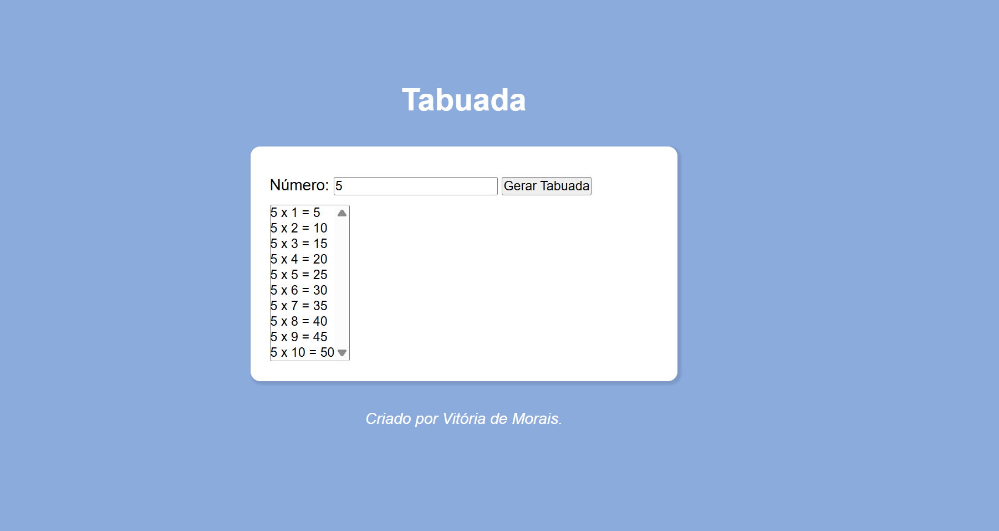

# 🔢 Projeto Tabuada

Este projeto foi criado para praticar meus conhecimentos em **HTML, CSS e JavaScript**. Criei uma aplicação simples e interativa que gera a tabuada de qualquer número digitado pelo usuário (e tratamento de erro).

## 🚀 Funcionalidades

- Gerar tabuadas automaticamente
- Interface simples e intuitiva
- Alerta de campo vazio
- Resultados exibidos dinamicamente com JavaScript

## 🛠️ Tecnologias utilizadas

- HTML5
- CSS3
- JavaScript

## 📚 O que pratiquei nesse projeto

- Manipulação do DOM
- Eventos em JavaScript
- Estruturas de repetição (`for`)
- Condições (`if`)
- Estilização com CSS

## 📸 Imagem do projeto

()

## 🌐 Acesse o projeto

🔗 [Clique aqui para visualizar o site](https://vickmoraisdev.github.io/projeto-tabuada/)

## 💡 Objetivo

O principal objetivo desse projeto foi colocar em prática conceitos básicos de JavaScript aprendidos durante meus estudos, focando na lógica de programação e interação com o usuário.

---

Feito com 💜 por Vitória de Morais